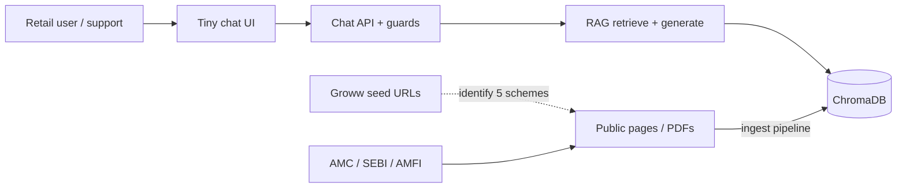
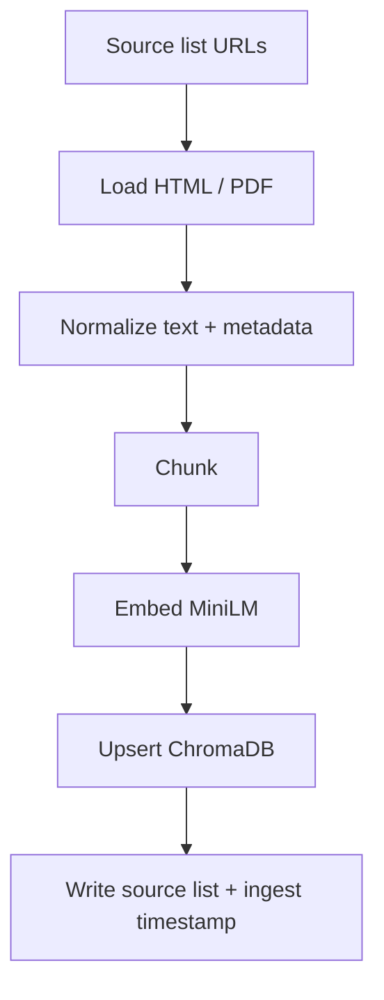

# Architecture  
**Product:** Mutual Fund FAQ RAG Chatbot  
**Based on:** [PRD.md](./PRD.md) v1.0  
**Version:** 1.0  
**Last updated:** 2026-09-27  

This document specifies how the prototype is built: ingestion, retrieval, generation, safety, and UI. Product rules (facts-only, citations, PII, no returns math) live in the PRD; this file is the system design that implements them.

---

## 1. Design principles

1. **Indexed RAG, not live browse.** v1 loads a curated public corpus once (rebuildable), then answers from ChromaDB. No per-query web agent.  
2. **Both RAG stages are first-class:** data **ingestion** and data **retrieval**.  
3. **Grounded generation.** The LLM may only use retrieved chunks. Weak retrieval → no invented fees.  
4. **Safety in the application layer.** Advice, returns-comparison, and PII handling are deterministic checks, not model-only promises.  
5. **One citation per answer.** The URL of the best supporting chunk (prefer official AMC / SEBI / AMFI over Groww seed pages).  
6. **Rebuildable corpus.** Every ingested document has a public URL and fetch/ingest date listed in the source list.

---

## 2. System context



- **Groww URLs** identify the five HDFC schemes. They are not the citation source of record.  
- **Official AMC / SEBI / AMFI** documents (factsheets, KIM/SID, FAQs, charges, riskometer/benchmark, statement guides) are loaded into the vector store and cited in answers.

---

## 3. High-level components

| Component | Responsibility |
| --- | --- |
| **Source registry** | YAML/CSV/MD of URLs, scheme, `doc_type`, allowed domains. Input to loading. |
| **Loader** | HTTP fetch of HTML/PDF; extract text; attach `url`, `fetched_at`, `scheme`. |
| **Chunker** | Heading-aware / recursive split; metadata per chunk. |
| **Embedder** | `sentence-transformers/all-MiniLM-L6-v2` for documents and queries (same model). |
| **Vector store** | Persistent **ChromaDB** collection of embeddings + metadata. |
| **Query guards** | Classify/refuse advice; block returns computation; detect PII (do not persist). |
| **Retriever** | Embed query → top-k similarity search → optional scheme filter. |
| **Generator** | Grounded completion: ≤3 sentences, no advice, facts from context only. |
| **Answer assembler** | Body + single citation URL + `Last updated from sources:` + disclaimer already in UI. |
| **UI** | Welcome, 3 example questions, facts-only note, chat. |

Ingestion is a **batch CLI/script**. Query path is a **local web app** (Python). Generation model is an implementation choice (must be documented in README); it must be strictly context-grounded.

---

## 4. End-to-end pipelines

### 4.1 Ingestion (offline / rebuild)

```
Loading → Chunking → Embedding → Store vector data
```



| Stage | Behavior |
| --- | --- |
| **Loading** | Fetch only URLs in the registry. Parse HTML (main content) or PDF text. Drop navigation chrome. Record `url`, `scheme`, `doc_type`, `fetched_at`. Skip blogs / unofficial domains. |
| **Chunking** | See §5. |
| **Embedding** | Encode each chunk with `sentence-transformers/all-MiniLM-L6-v2` (384-dim). |
| **Store** | Persist in ChromaDB on disk (e.g. `data/chroma/`). Collection name e.g. `hdfc_mf_faq`. Include metadata fields used at query time. Idempotent rebuild: wipe collection or upsert by `chunk_id`. |

### 4.2 Retrieval and generation (online)

```
User query → Guards → Embed query → Retrieve top-k → Grounded generation → Answer + citation
```

```mermaid
sequenceDiagram
  participant U as User
  participant UI as UI
  participant G as Guards
  participant E as Embedder
  participant V as ChromaDB
  participant L as Generator
  participant A as Assembler

  U->>UI: question
  UI->>G: raw text
  G-->>UI: PII warning if needed (no store)
  alt advice / buy-sell / ranking
    G-->>UI: refusal + educational official link
  else returns / performance compare
    G-->>UI: no compute; factsheet link
  else factual
    G->>E: query
    E->>V: vector + optional scheme filter
    V-->>L: top-k chunks
    alt weak / empty retrieval
      L-->>A: we don't have this in prototype
    else grounded
      L-->>A: ≤3 sentences from context
    end
    A-->>UI: text + one URL + last-updated
  end
```

- **k:** start at **5**, allow **3–8** after eval.  
- **Similarity floor:** if top score is below a threshold (tune on gold Q&A), treat as miss — do not guess.  
- **Citation:** URL of the chunk with highest score among those actually used in the answer (v1: URL of `#1` retrieved chunk if the generator used it; if generation cites a later chunk, use that chunk’s `url`). Always **exactly one** link.  
- **Last updated from sources:** `max(fetched_at)` of chunks passed to the generator (or corpus ingest date if all docs share one ingest run).

---

## 5. Chunking strategy

Chosen for **FAQ-style field retrieval** (expense ratio, exit load, SIP, lock-in, riskometer) on mixed **HTML + PDF** official docs, including **table-heavy factsheets** and **narrative KIM/SID**.

**Default (until first corpus inspect + gold eval):**

| Parameter | Value |
| --- | --- |
| Splitter | Recursive character split, **heading-aware** where HTML/PDF outlines exist (`h1–h3`, factsheet section titles) |
| Size | ~**400–800 tokens** per chunk (character proxy: ~1,600–3,200 chars; tune) |
| Overlap | **10–15%** so table rows / fee sentences are not cut from their label |
| Separators | `\n## `, `\n# `, `\n\n`, `\n`, `. `, space |
| Tables | Prefer keep a fee/SIP/load table in **one chunk** when possible; if too large, split by row groups but repeat column headers in the next chunk |

**Metadata on every chunk**

| Field | Use |
| --- | --- |
| `chunk_id` | Stable id: hash(`url` + start offset) |
| `url` | Citation |
| `scheme` | Filter retrieval to the named fund when the query names it |
| `doc_type` | `factsheet` \| `kim` \| `sid` \| `faq` \| `charges` \| `riskometer` \| `statement_guide` |
| `section_title` | Retrieval debug + prompt context |
| `fetched_at` | Last-updated line |
| `amc` | `HDFC` |

**Tune after first retrieval eval** on the 5–10 gold questions (expense ratio, SIP, lock-in, exit load, riskometer/benchmark, statement download). If tables fragment, increase size or add a table-specific splitter.

---

## 6. Retrieval details

| Topic | v1 choice |
| --- | --- |
| Query embedding | Same MiniLM model as documents |
| Search | Dense cosine / Chroma default on the collection |
| Filters | If query mentions a scheme (or example-question chip includes it), `where: scheme = …` |
| Hybrid search | Out of scope for v1 (no BM25 required) |
| Reranker | Out of scope for v1; add only if gold set fails |
| Multi-scheme questions | If two schemes named, retrieve without filter or run two filtered searches and keep top chunks; still **one** citation (best single supporting URL) or refuse to compare returns |

Prompt context to the generator: concatenated chunks with `url` and `section_title` prefixes so the model can stay faithful; the **assembler** still emits only one user-facing link.

---

## 7. Generation and answer contract

**System instructions (must enforce in code + prompt):**

- Use only the provided excerpts.  
- At most **three sentences** of answer body.  
- No buy/sell, ranking, suitability, or portfolio advice.  
- No return/CAGR/NAV computation or comparison.  
- If excerpts do not contain the fact, say this prototype does not have it; optional hub link (AMC/AMFI/SEBI), still one URL.

**Answer payload (API → UI)**

```json
{
  "text": "…",
  "source_url": "https://…",
  "last_updated_from_sources": "2026-09-27",
  "refusal": false,
  "refusal_reason": null
}
```

Citation and last-updated are **outside** the three-sentence count (PRD).

---

## 8. Application-layer guards

Do not rely on the LLM alone (PRD §7.3).

| Guard | Trigger (examples) | Action |
| --- | --- | --- |
| **Advice** | should I buy/sell, best fund, allocate, suitable for me | Polite facts-only refusal + educational official link (AMFI investor education or SID “risks” page — pick one stable URL, document in source list) |
| **Performance** | returns, CAGR, beat benchmark, which performed better | Do not compute; link official **factsheet** for the named scheme if known, else AMC factsheet hub |
| **PII** | PAN, Aadhaar, account numbers, OTP, email, phone | Do **not** write to Chroma, logs, or chat history stores. Warn in UI. Strip or redact before any logging. Continue as anonymous FAQ. |
| **Out of corpus** | Other AMC, other schemes, live holdings | Prototype scope message; no hallucination |

PII patterns: conservative regex + keyword checks is enough for a prototype; false positives (e.g. “email me the factsheet link”) should still avoid storing addresses.

---

## 9. Data and persistence

```
data/
  sources.csv          # URL, scheme, doc_type, fetched_at
  chroma/              # Chroma persistent dir (gitignored)
  raw/                 # optional cached HTML/PDF for rebuild (gitignored or LFS)
```

**Do persist:** chunk text, embeddings, public URLs, ingest dates, scheme metadata.  
**Do not persist:** user identifiers, PAN/Aadhaar/OTP/email/phone, conversation PII.

Chat history: in-memory for the session only, or omit persistence entirely for v1.

---

## 10. Suggested repo layout

```
docs/PRD.md
docs/architecture.md
docs/problemstatement.txt
README.md
data/sources.csv
src/
  ingest/
    load.py
    chunk.py
    embed.py
    store.py
  rag/
    retrieve.py
    generate.py
    assemble.py
  guards/
    advice.py
    pii.py
    performance.py
  app/
    main.py          # UI + API
scripts/
  ingest.py          # rebuild index
```

Exact filenames can change; **ingest vs retrieve packages must stay separate** so both RAG stages are explicit.

---

## 11. Technology stack (v1)

| Layer | Choice |
| --- | --- |
| Language | Python 3.11+ |
| Embeddings | `sentence-transformers/all-MiniLM-L6-v2` |
| Vector DB | ChromaDB (persistent client) |
| Loading | `httpx`/`requests` + HTML parser + PDF text extract (e.g. `pypdf` or `pymupdf`) |
| Chunking | LangChain / LlamaIndex splitter **or** equivalent custom recursive splitter — same parameters as §5 |
| UI | Streamlit or Gradio (fastest for tiny chat + example chips) |
| Generator | Document in README (local LLM or hosted API). Must support a system prompt and context window large enough for top-k chunks. |

Local-first: index build and chat should run on a laptop (PRD NFR1–NFR2). Target: **seconds per answer** after the index exists.

---

## 12. Failure modes

| Failure | User-visible behavior |
| --- | --- |
| Empty / low-similarity retrieval | No invented numbers; “not in this prototype” + optional official hub link |
| Generator error / timeout | Generic safe error; no partial fake fee |
| Fetch failure at ingest | Fail the document, list it in README known limits; do not index empty pages |
| Ambiguous scheme | Ask user to name one of the five funds, or retrieve unfiltered and answer only if one scheme dominates chunks |

---

## 13. Mapping to PRD

| PRD | Architecture |
| --- | --- |
| G4 / §7 ingestion | §4.1 Loading → Chunking → Embedding → Chroma |
| G4 / §7 retrieval | §4.2 Embed → top-k → generate |
| FR2, MiniLM + Chroma | §3, §11 |
| FR3–FR5 answer shape | §7 assembler |
| FR6–FR7, FR10 safety | §8 guards |
| FR8 UI | Tiny Streamlit/Gradio shell |
| FR9 rebuild index | `scripts/ingest.py` |
| NFR5 no hallucinated fee | similarity floor + grounded prompt |
| Later: no live web agent | §1 indexed RAG only |

---

## 14. Open implementation choices (from PRD §12)

| Item | Architecture stance |
| --- | --- |
| Generator model | Not fixed; README must name it; grounding rules are fixed. |
| Groww vs official | Ingest and cite **official** pages; Groww only in seed/scoping list unless an official URL is missing (then document as a known limit). |
| Chunk sizes | §5 defaults; change only with gold-set evidence. |
