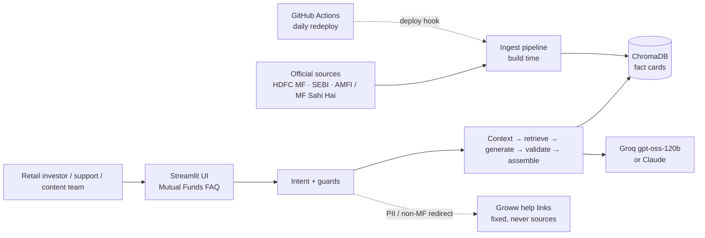
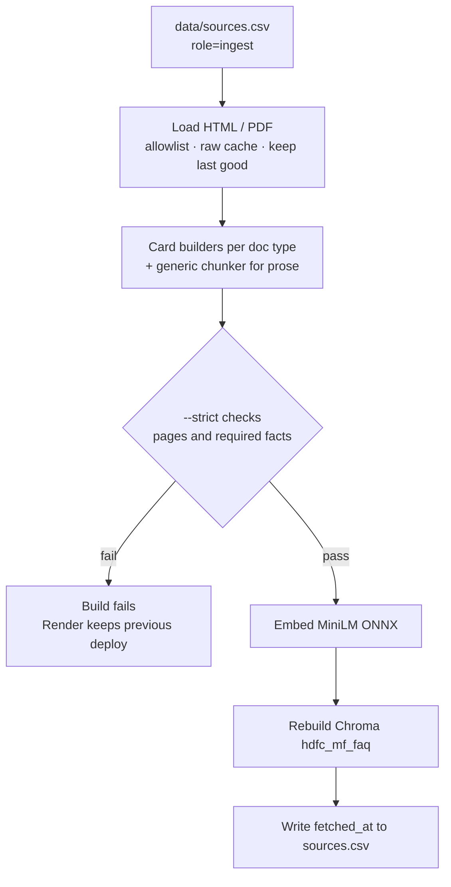
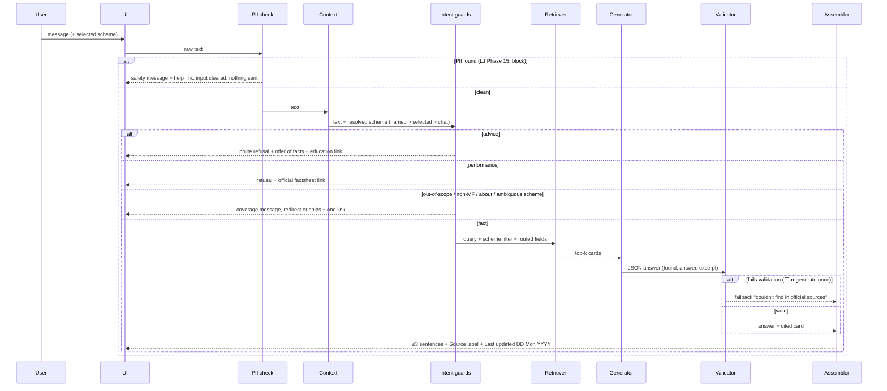

# Architecture

**Product:** Facts-Only Mutual Fund FAQ Assistant (HDFC MF), a RAG chatbot
**Based on:** [PRD.md](./PRD.md) (PRD: Facts-Only Mutual Fund FAQ Assistant, 2 Oct 2026) incl. its owner-decision Addendum (A1–A7)
**Plan:** [implementation.md](./implementation.md) (phases referenced below)
**Version:** 2.0 · **Last updated:** 2026-10-02

This document is the system design that implements the PRD: ingestion, retrieval,
generation, safety, conversation context, UI, freshness and deployment. Product rules
live in the PRD; this file says how they are built.

**Status legend:** ✅ built (Part A, running today) · ⬜ planned (Part B, with its
implementation phase). Today the deployed system runs on the five Groww pages
(Part A); Part B moves it to the PRD's official ~22-page corpus.

---

## 1. Design principles

1. **Indexed RAG, not live browse.** A curated corpus is ingested at build time and
   answered from ChromaDB. No per-query web fetching.
2. **Official sources only.** Only allowlisted domains are ingested or cited: HDFC MF,
   SEBI, AMFI / Mutual Funds Sahi Hai (PRD §4). Groww appears only as two fixed help links (A5). ⬜ Phase 12–13
3. **Safety before retrieval.** PII, advice, performance and scope are decided by
   deterministic code in a fixed precedence order (PRD §6), not by the model.
4. **Grounded, validated generation.** The model sees only retrieved cards. Code
   enforces the PRD's response rules: ≤ 3 sentences, numbers present in the sources,
   banned words, one allowlisted link.
5. **One link and one freshness line on every response**, including refusals (PRD §7, FR-5/6).
6. **Data-driven chunking.** Each supported fact becomes one self-contained "fact card"
   that names its scheme, so a question retrieves exactly that fact.
7. **Rebuildable and fresh.** Every document has a URL, publisher and ingest date. The
   index is rebuilt on every deploy and refreshed daily; stale facts are flagged.
8. **Both RAG stages are explicit:** `src/ingest/` (Loading → Chunking → Embedding →
   Store) is separate from the query path (`src/guards/`, `src/rag/`).

---

## 2. System context



---

## 3. Components

| Component | Responsibility | Module | Status |
|---|---|---|---|
| Source registry | URLs with publisher, doc type, scheme, question types, freshness limit, role, ingest date | `data/sources.csv`, `data/schemes.md` | ✅ official, 24 + 2 help (12) |
| Scheme names | Canonical names, aliases, former names, categories | `src/schemes.py` | ✅ partial · ⬜ aliases (15) |
| Loader | Fetch HTML/PDF/.xlsx, extract main text, clean HDFC scheme pages, allowlist, raw cache, keep last good copy | `src/ingest/load.py` | ✅ (13) |
| Card builders | Parse each document type into fact cards | `src/ingest/official.py` (· `groww.py` for the MVP corpus) | ✅ (14) |
| Generic chunker | Heading-aware recursive split for prose documents | `src/ingest/chunk.py` | ✅ |
| Embedder | MiniLM-L6-v2 via ONNX Runtime, 384-dim, normalized | `src/ingest/embed.py` | ✅ |
| Vector store | Persistent Chroma `hdfc_mf_faq`, cosine, idempotent rebuild | `src/ingest/store.py`, `chroma_compat.py` | ✅ |
| Ingest CLI | load → chunk → embed → store; `--refresh`, `--strict`, `--check-only` | `scripts/ingest.py` | ✅ (13) |
| Guards | PII, advice, performance, scope, about, clarify | `src/guards/*` | ✅ · ⬜ PRD §6 rules (15) |
| Conversation context | Last 25 exchanges; fund and topic carry-over | `src/rag/context.py` | ✅ |
| Retriever | Query expansion, scheme filter, field routing, holdings name lookup | `src/rag/retrieve.py` | ✅ · ⬜ re-tune (16) |
| Holdings check | Definite "not among the N holdings" (A1) | `src/rag/holdings.py` | ✅ |
| Generator | Grounded JSON answer; Groq / Claude / extractive | `src/rag/generate.py` | ✅ |
| Validator | 3-sentence cap, number grounding · ⬜ banned words, return figures, link allowlist, regenerate once | `src/rag/generate.py` (+ ⬜ `validate.py`) | ✅ partial · ⬜ (17) |
| Assembler | One link, freshness line, miss / ungrounded / error replies | `src/rag/assemble.py` | ✅ · ⬜ template (17) |
| Facts reader | Structured facts for the UI from the same cards | `src/rag/facts.py` | ✅ |
| UI | Scheme panel, fund cards, fact sheet, pills, chat | `src/app/main.py` | ✅ · ⬜ PRD §9 copy and feedback (19) |
| Evaluation | Gold set, fund × field matrix, guard tests, chat test · ⬜ 200 golden set + report | `scripts/eval_gold.py`, `debug_*.py` | ✅ · ⬜ (20) |
| Deployment | Render free web service, daily redeploy | `render.yaml`, `.github/workflows/refresh-data.yml` | ✅ |

---

## 4. Pipelines

### 4.1 Ingestion (build time)

```
Loading → Chunking (card builders) → Embedding → Store vector data
```



| Stage | Behaviour |
|---|---|
| Loading | Fetch only `role=ingest` rows on the allowlist. HTML: main text, chrome removed; HDFC scheme pages also lose returns, suitability and pitch blocks. PDF: text per page, garbled-font lines dropped. TER workbook: one line per row. A page is cached in `data/raw/` only once its text passes; a failed or unusable fetch falls back to that last good copy and is reported as `STALE` (PRD §8). |
| Chunking | Card builders per document type (§5). The generic splitter handles prose. |
| Strict checks | Every page loaded (fresh or last good); per-document-type required text (e.g. TER, min SIP, exit load on scheme pages; ELSS lock-in; all five schemes in the factsheet and TER file); no performance text on scheme pages. ⬜ (14) card-level field checks. Otherwise exit 1 before touching the index. `--check-only` runs this without rebuilding. |
| Embedding | MiniLM-L6-v2 (official ONNX export), batch 32, L2-normalized. |
| Store | Drop and recreate the collection; ids = `chunk_id`; metadata as in §5. |

### 4.2 Query path (online)



---

## 5. Chunking strategy (data-driven)

The brief asks for a chunking strategy chosen from the data. The corpus is a mix of
structured pages (scheme pages, TER report, factsheet tables) and prose (KIM/SID,
statement guides, education pages). Every **supported fact becomes one fact card**,
and prose is split by headings.

**Fact card format:** `<Scheme> (Direct Plan – Growth): <Field label with synonyms>: <value>[, as on <date>].`
For example: *"HDFC Small Cap Fund Direct Growth: Expense ratio (TER, total expense ratio): 0.79%."*

| Document type | Strategy | Cards / chunks | Status |
|---|---|---|---|
| Groww scheme page | Label/value parser | NAV, TER, AUM, min SIP and lump sum, exit load and history, stamp duty, tax, riskometer, benchmark, objective, managers and profiles, holdings and holdings analysis, fund house, registrar, overview | ✅ (replaced in Part B) |
| HDFC scheme page | Field parser | Exit load, min SIP, riskometer, benchmark, AUM, lock-in, entry load, managers, inception, factual FAQs, glossary (A1) | ✅ 14 |
| KIM | Labelled sections (two KIM layouts), stopping before any returns table | Full exit-load rules (incl. tiers), lump-sum minimums, **ELSS lock-in rule**, former name | ✅ 14 |
| Monthly factsheet | Per-fund block (heading → Grand Total), field cards; returns and risk-ratio tables skipped | Direct NAV with "as on" date, objective, inception, manager details, holdings, holdings analysis (A1) | ✅ 14 |
| TER disclosure | Workbook rows, latest day per scheme | Total TER Direct (with components) and Regular | ✅ 14 |
| Statement pages | Generic sections, field `statement_steps` | How to get account / capital-gains statements, CAS | ✅ 14 |
| SEBI / AMFI | Generic sections, fields `riskometer_levels` / `education` | Riskometer levels, ELSS and SIP basics, investor education | ✅ 14 |
| Holdings analysis | Asset mix and instrument split from the factsheet's stated subtotals; sector split calculated and labelled | Asset class, instrument type, sector | ✅ (A1) |

**Generic splitter** (prose): heading-aware recursive split, 1,600–3,200 chars, ~12%
overlap, separators `\n## `, `\n# `, `\n\n`, `\n`, `. `, space; fee tables kept whole or
split by rows with headers repeated.

**Metadata on every chunk**

| Field | Use |
|---|---|
| `chunk_id` | Stable id: hash(url + field/label) for cards, hash(url + offset) for prose |
| `url` | The citation (most specific page, FR-7) |
| `publisher` | HDFC MF / SEBI / AMFI; source label |
| `scheme` | Retrieval filter; `ALL` for shared documents |
| `plan` | `Direct Plan - Growth` for plan-specific facts (FR-3) |
| `doc_type` | scheme_page, kim, sid, factsheet, ter, statement_guide, education, riskometer |
| `field` | Fact type (`expense_ratio`, `exit_load`, `lock_in`, …); drives routing and evaluation |
| `section_title` | Readable label, prompt context |
| `doc_date` | Date the document states (e.g. factsheet "as on", TER day, KIM date); conflicts and freshness |
| `fetched_at` | Ingest date: the freshness line |
| `amc` | `HDFC` |

---

## 6. Retrieval

| Topic | Choice | Status |
|---|---|---|
| Query embedding | Same MiniLM (ONNX) as documents, on the query plus expanded synonyms ("fund size" → "assets under management") | ✅ |
| Search | Dense cosine in Chroma | ✅ |
| Scheme filter | Resolved scheme(s) before ranking (PRD §11 mitigation); shared `ALL` documents stay reachable | ✅ |
| Field routing | Question type → card fields; a filtered search on those fields goes first | ✅ · ⬜ re-tune for official types (16) |
| Holdings name lookup | Exact, case-insensitive match of company names across the fund's holdings cards (A1) | ✅ |
| top-k / floor | `TOP_K = 8`; `MIN_SCORE = 0.35` (in-scope ≥ 0.42, off-topic ≤ 0.24 on the current index) | ✅ · ⬜ re-calibrate (16) |
| Conflicting sources | Prefer the card with the newest `doc_date`; log the conflict (PRD §8) | ⬜ 16 |
| Factual comparison | Only when one page supports both facts; otherwise answer the first scheme and invite a second question (PRD §8) | ⬜ 16 |
| Hybrid search / reranker | Not used; add only if the golden set fails | — |

**Field routing table (target)**

| Question type | Card fields | Typical source |
|---|---|---|
| Expense ratio | `expense_ratio` | TER page, scheme page |
| Exit load | `exit_load` | Scheme page, KIM |
| Minimum SIP | `min_sip` | Scheme page, KIM |
| ELSS lock-in | `lock_in` | KIM / SID |
| Riskometer | `riskometer` | Scheme page; meaning from SEBI |
| Benchmark | `benchmark` | Scheme page, factsheet |
| Statement download | `statement_steps` | HDFC statement pages |
| A1 extras | `nav`, `aum`, `fund_managers`, `holdings`, `holdings_breakdown`, `definition`, `fund_house` | Factsheet, scheme page, AMFI |

---

## 7. Response contract

**Template (every response, PRD §7)**

1. Body: 1–3 sentences; the first states the fact with the full scheme name and plan.
2. Source: one link with a readable label, e.g. *"Source: HDFC Small Cap Fund – scheme page"*.
3. Freshness: *"Last updated from sources: DD Mon YYYY"* (the cited page's ingest date).

**Payload (pipeline → UI)**

```json
{
  "text": "…",
  "source_url": "https://…",
  "source_label": "HDFC Small Cap Fund – scheme page",
  "last_updated_from_sources": "2026-10-02",
  "refusal": false,
  "refusal_reason": null
}
```

`source_label` is ⬜ Phase 17. The UI formats the date as DD Mon YYYY.

**Links for non-answer responses (fixed table, never model-generated)**

| Response | Link | Status |
|---|---|---|
| Advice refusal (FR-8) | AMFI / Mutual Funds Sahi Hai or SEBI investor education | ⬜ 15 (currently no link) |
| Performance refusal (FR-9) | Official HDFC MF factsheet | ✅ |
| Out-of-scope (FR-14) | Relevant HDFC MF page (schemes listing for "scheme not in corpus") or AMFI | ✅ AMFI · ⬜ listing (15) |
| Non-MF redirect (FR-15) | https://groww.in/help | ⬜ 15 |
| PII block (FR-11) | https://groww.in/help/mutual-funds | ⬜ 15 |
| Miss / fallback (FR-1) | The resolved scheme's official page | ✅ |
| About / clarify | Official schemes listing or AMFI page | ⬜ 17 |

**Validator (FR-4 and grounding)**
- ✅ At most 3 sentences.
- ✅ Every number must appear in the retrieved cards (`UngroundedNumberError` gives an
  honest "I can only give figures stated in the sources").
- ⬜ (17) Rejects return figures, recommendation verbs (should, better, best, suitable)
  and banned tone words (safe, good, ideal, recommended, guaranteed).
- ⬜ (17) The link must be in the corpus or the fixed table.
- ⬜ (17) On rejection, regenerate once, then use the FR-1 fallback.
- ⬜ (17) Stale sentence: when the cited page is past its freshness limit, add
  "Please check the linked page for the latest value" (counts toward the 3 sentences).

---

## 8. Intent and guards (PRD §6)

Fixed precedence; the first rule that fires decides. When unsure between fact and
advice, choose advice. Mixed messages follow the highest-precedence intent.

| # | Intent | Trigger (examples) | Action | Status |
|---|---|---|---|---|
| 1 | PII | PAN, Aadhaar (Verhoeff checksum ⬜), 10-digit mobile, email, OTP, account/folio | ⬜ **Block**: nothing sent to retrieval, the model or logs; safety message; help link; input cleared. Server-side redaction stays as a backstop. | ✅ redact · ⬜ block (15) |
| 2 | Advice | should I buy/sell/hold/switch, which is better/suitable, own portfolio or goals | Polite refusal + offer of facts + one education link | ✅ refusal · ⬜ offer + link (15) |
| 3 | Performance | returns, CAGR, beat benchmark, rankings, NAV growth | Refusal + factsheet link; no figures | ✅ |
| 4 | Out-of-scope | Other AMCs, other HDFC schemes, Regular/IDCW ⬜, live data | Coverage message + one official link | ✅ · ⬜ Regular/IDCW (15) |
| 4b | Non-MF ⬜ | Stocks, loans, cards, general chat | One-line redirect to Groww help | ⬜ 15 |
| — | About | "Which funds can you access?" | Fixed list of the five schemes and supported facts | ✅ |
| — | Ambiguous scheme | Fact question naming no fund (and none in context); two fuzzy matches ⬜ | "Which fund do you mean?" + chips | ✅ · ⬜ chips, fuzzy (15) |
| 5 | Fact | One of the 7 types (+ A1 extras) for an in-scope scheme | RAG answer | ✅ |

**Scheme resolution (FR-2/3):** canonical names, former names (HDFC Top 100 → Large
Cap, HDFC Equity Fund → Flexi Cap, HDFC Taxsaver → ELSS) and short forms (BAF,
"hdfc smallcap") resolve to one scheme. Answers default to Direct Plan – Growth; TER
answers add "Regular Plan values differ; see the linked page" ⬜ 15/17. Company names
inside holdings questions are not treated as other AMCs ✅.

---

## 9. Conversation context ✅ (Addendum A2)

- The last **25 exchanges** (redacted questions + answer texts) live in browser-session
  memory only.
- **Scheme priority** for a question naming no fund: the scheme named in the question,
  then the scheme selected in the UI, then the most recent fund in the chat. The UI
  notes which one it assumed.
- Short follow-ups ("What about Large Cap?") are searched together with the previous
  question and passed to the generator with it.
- History only helps interpret the question. Facts must come from the cards retrieved
  for it, and the number check runs against those cards only.

---

## 10. Freshness and refresh

| Item | Design | Status |
|---|---|---|
| Freshness limits | TER 7 days, factsheet 35 days, KIM/SID 180 days, others per `sources.csv` | ⬜ 18 |
| Re-ingest | Every Render deploy (`ingest.py --refresh --strict`); daily redeploy via GitHub Actions at 21:00 IST | ✅ |
| Failed fetch | Keep the last good copy; report in the build log | ✅ (13) |
| Dated editions | Factsheet/KIM/SID URLs change per edition (JS hub pages can't be crawled): monthly update of `sources.csv`; `--strict` flags missing editions | ⬜ 18 |
| Link health | Report 4xx/5xx for every source URL in the scheduled workflow (PRD §11) | ⬜ 18 |
| UI staleness | Banner when the corpus is older than 3 days | ✅ |
| Volatile facts in evaluation | Checked against current cards (`card:<field>`) so tests survive refreshes | ✅ |

---

## 11. Data and persistence

```
data/
  sources.csv       # source list (deliverable): url, publisher, doc_type, scheme,
                    #   question_types, freshness_limit_days, role, fetched_at  (⬜ 12)
  schemes.md        # scheme names, aliases, per-source notes, known gaps
  golden_set.csv    # ⬜ 200 labelled queries (20)
  chroma/           # vector store (git-ignored; rebuilt by ingest)
  raw/              # cached downloads (git-ignored)
.cache/             # embedding model (HF_HOME on Render; git-ignored)
```

**Persisted:** public URLs, card text, embeddings, ingest dates, scheme metadata.
**Never persisted:** PAN, Aadhaar, OTP, email, phone, account/folio numbers, raw user
messages, chat history (session memory only), or feedback (session only, A3).

---

## 12. UI (Streamlit)

| Element | Design | Status |
|---|---|---|
| Header | "Mutual Funds FAQ"; pinned "Facts-only. No investment advice." | ✅ |
| Welcome line, 3 example chips | Exact PRD §9 copy | ✅ own copy · ⬜ PRD copy (19) |
| Input hint | "Ask a factual question. Don't share PAN, Aadhaar or account details." | ⬜ 19 |
| Answer bubble | Body, readable source label (opens in a new tab), freshness line in secondary text | ✅ link pill · ⬜ label and format (19) |
| PII block state | Inline warning above the input, input cleared, nothing sent | ⬜ 19 |
| Feedback | 👍 / 👎 + optional reason; session only (A3) | ⬜ 19 |
| Scheme panel, fund cards, fact sheet (A1) | Left picker; cards with live figures; fact sheet with asset mix and top holdings; all read from Chroma (`facts.py`) | ✅ (fed by official cards in ⬜ 19) |
| No transaction CTAs; accessibility labels | — | ✅ no CTAs · ⬜ labels (19) |

---

## 13. Deployment ✅

- **Render free web service** (`render.yaml`):
  - build `pip install -r requirements.txt && python scripts/ingest.py --refresh --strict`
  - start `streamlit run src/app/main.py --server.port $PORT --server.address 0.0.0.0 --server.headless true`
  - health check `/_stcore/health`
- Env: `GROQ_API_KEY` (secret), `GROQ_MODEL`, `PYTHON_VERSION=3.12.10`,
  `HF_HOME=/opt/render/project/src/.cache/huggingface` (the model must live inside the
  project to survive into runtime), `ANONYMIZED_TELEMETRY=False`.
- **Memory:** peak about 305 MB (model + Chroma + Streamlit) of the 512 MB free limit.
  Cold start after sleep is ~30–60 s.
- **Daily refresh:** `.github/workflows/refresh-data.yml` calls the Render deploy hook
  (secret `RENDER_DEPLOY_HOOK_URL`).
- **Platform workarounds:** PyTorch and grpcio DLLs are blocked by Windows Application
  Control on the dev machine. Embeddings run via ONNX Runtime, and
  `chroma_compat.py` stubs the unused gRPC tracing exporter. Both are no-ops on Linux.

---

## 14. Evaluation

| Suite | What it checks | Cost | Status |
|---|---|---|---|
| Fund × field matrix (`eval_gold.py --matrix`) | Top-1 card is the right fund and field | Free | ✅ 50/50 |
| Gold set (`eval_gold.py`) | Retrieval rank, answer contains fact, source cited | Free (`--retrieval-only`) / Groq | ✅ 19/20 |
| Guard tests (`debug_guards.py`) | Intent routing, PII never leaks | Free | ✅ 58/58 |
| Chat test (`debug_chat.py`) | Multi-turn follow-ups | Free (`--no-llm`) / Groq | ✅ 8/8 |
| **Golden set (200)** | PRD §10 metrics: accuracy, citation, refusal recall/precision, format, PII, fabrication | Free mode / full mode (about a day's Groq quota) | ⬜ 20 |

Evaluation runs locally, never in the Render build.

---

## 15. Repo layout

```
docs/  PRD.md · PRD (….pdf) · architecture.md · implementation.md · problemstatement.txt
       eval_notes.md · sample_qa.md · ⬜ evaluation_report.md
data/  sources.csv · schemes.md · ⬜ golden_set.csv
src/
  schemes.py                  # scheme names, aliases, categories
  ingest/  load.py · chunk.py · groww.py · ⬜ official card builder
           embed.py · store.py · chroma_compat.py
  guards/  pipeline.py · pii.py · advice.py · performance.py · scope.py
           about.py · clarify.py · common.py
  rag/     pipeline.py · context.py · retrieve.py · holdings.py
           generate.py · assemble.py · facts.py · ⬜ validate.py
  app/     main.py
scripts/  ingest.py · eval_gold.py · make_sample_qa.py · debug_ask.py
          debug_chat.py · debug_guards.py · debug_retrieve.py
          dump_chunks.py · dump_embeddings.py · ⬜ eval_golden.py · ⬜ check_links.py
render.yaml · .github/workflows/refresh-data.yml · requirements.txt · .env.example
```

---

## 16. Technology stack

| Layer | Choice |
|---|---|
| Language | Python 3.12 (3.11+ supported) |
| Loading | `httpx`, BeautifulSoup, `pypdf` |
| Embeddings | `sentence-transformers/all-MiniLM-L6-v2`, official ONNX export via `onnxruntime` + `tokenizers` |
| Vector DB | ChromaDB 1.5 (persistent client, cosine) |
| Generator | Groq free tier `openai/gpt-oss-120b` (strict JSON schema, low reasoning); Claude via Anthropic SDK if `ANTHROPIC_API_KEY` is set; extractive fallback |
| UI | Streamlit 1.64 with custom theme and CSS |
| Hosting | Render free web service; GitHub Actions for the daily refresh |

All dependencies are pinned in `requirements.txt`.

---

## 17. Failure modes

| Failure | Behaviour | Status |
|---|---|---|
| Low-similarity / empty retrieval | "Couldn't find this in official sources" + the scheme page; never a guess (FR-1) | ✅ |
| Answer with a figure not in the sources | Rejected; honest "only figures stated in the sources" reply | ✅ |
| Answer failing FR-4 (banned word, return figure, bad link, > 3 sentences) | Regenerate once, then the FR-1 fallback | ⬜ 17 |
| Generator error / rate limit | Retry with backoff on 429; then a generic safe error, no partial facts | ✅ |
| Fetch failure at ingest | Use the last good copy and report it; `--strict` fails the build if a required page or fact is missing, and Render keeps serving the previous deploy (Render's cache starts empty) | ✅ |
| Source blocks cloud IPs (e.g. HDFC bot protection, SEBI) | Strict build fails visibly; fallback is a committed snapshot | ⬜ 18 if needed |
| Stale page | Freshness line on every answer; stale sentence past the limit (⬜ 17); UI banner (✅) | partial |
| Ambiguous scheme | Clarify with chips | ✅ text · ⬜ chips |

---

## 18. Mapping to the PRD

| PRD | Architecture | Status |
|---|---|---|
| §4 scope, corpus, allowlist | §1, §5, §11 | ⬜ 12–14 |
| FR-1 answer only from passages | §4.2, §7 fallback, §17 | ✅ |
| FR-2 scheme resolution | §8 | ✅ partial · ⬜ 15 |
| FR-3 Direct plan default | §8 | ⬜ 15/17 |
| FR-4 validator | §7 | ✅ partial · ⬜ 17 |
| FR-5 one link from metadata | §7 | ✅ answers · ⬜ every response (17) |
| FR-6 freshness line | §7 | ✅ ISO · ⬜ DD Mon YYYY (17) |
| FR-7 most specific page | §5 metadata, §6 | ⬜ 16 |
| FR-8 advice refusal | §7, §8 | ⬜ 15 |
| FR-9 performance refusal | §7, §8 | ✅ |
| FR-10–13 PII | §8, §11, §12 | ✅ redact · ⬜ block (15/19) |
| FR-14 out of scope | §8 (A1 extras stay answerable) | ✅ · ⬜ Regular/IDCW |
| FR-15 non-MF redirect | §7, §8 | ⬜ 15 |
| §6 intent precedence | §8 | ✅ |
| §7 template and tone | §7 | ⬜ 17 |
| §8 edge cases | §6, §8, §10 | partial · ⬜ 15–18 |
| §9 UI | §12 | ✅ partial · ⬜ 19 |
| §10 golden set and metrics | §14 | ⬜ 20 |
| §11 risks | §6 scheme filter, §10, §17 | partial |
| §12 deliverables | §11, §14, README | ⬜ 21 |
| Addendum A1–A7 | §5, §9, §12, §13 | ✅ |

---

## 19. Open choices and known limits

| Item | Stance |
|---|---|
| Extra fields beyond the 7 types (A1) | Kept and answerable; documented deviation from FR-14 |
| Dated document URLs | Maintained monthly in `sources.csv` (hub pages are JS-rendered) |
| Cloud-IP blocking | Verify on the first Render build of the official corpus; snapshot fallback if needed |
| Groq free-tier quota | ~35 full answers' worth of tokens per day at current prompt sizes; the full golden-set run is occasional |
| Chunk sizes / reranker | Changed only with golden-set evidence |
| Generator | Groq now; Claude supported by setting `ANTHROPIC_API_KEY` |
