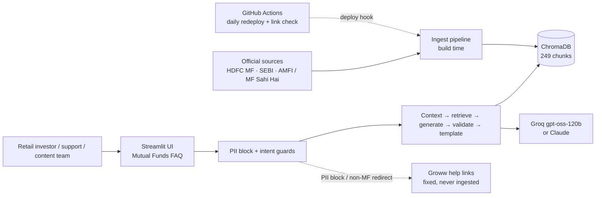
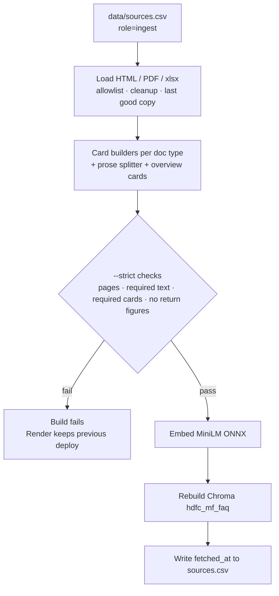
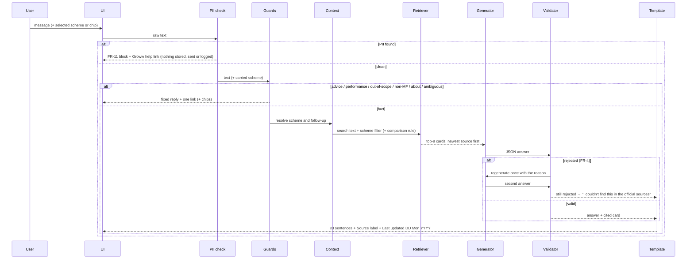

# Architecture

**Product:** Facts-Only Mutual Fund FAQ Assistant (HDFC MF), a RAG chatbot
**Based on:** [PRD.md](./PRD.md) (2 Oct 2026) including its owner-decision Addendum (A1–A7)
**Plan:** [implementation.md](./implementation.md) · **Evaluation:** [evaluation_report.md](./evaluation_report.md)
**Version:** 3.0 (as built) · **Last updated:** 2026-10-03

This is the system as built: ingestion, retrieval, generation, safety, conversation
context, UI, freshness and deployment. Product rules live in the PRD; this file says
how they are implemented and where.

---

## 1. Design principles

1. **Indexed RAG, not live browse.** A curated corpus is ingested at build time and
   answered from ChromaDB. No per-query web fetching.
2. **Official sources only.** Only allowlisted publishers are ingested or cited: HDFC
   MF, SEBI, AMFI / Mutual Funds Sahi Hai (PRD §4). Groww appears only as two fixed
   help-centre links (A5).
3. **Safety before retrieval.** PII, advice, performance and scope are decided by
   deterministic code in a fixed precedence order (PRD §6), never by the model.
4. **Grounded, validated generation.** The model sees only retrieved cards; code
   enforces the PRD's rules (numbers present in the sources, the FR-4 validator).
5. **One link and one freshness line on every response**, including refusals (FR-5/6).
6. **Data-driven chunking.** Each supported fact becomes one self-contained card that
   names its scheme, so a question retrieves exactly that fact.
7. **Rebuildable and fresh.** Every document has a URL, publisher, label, freshness
   limit and ingest date; the index is rebuilt on every deploy and refreshed daily.
8. **Both RAG stages are explicit:** `src/ingest/` (Loading → Chunking → Embedding →
   Store) is separate from the query path (`src/guards/`, `src/rag/`).

---

## 2. System context



---

## 3. Components

| Component | Responsibility | Module |
|---|---|---|
| Source registry | 24 ingest rows + schemes listing (reference) + 2 Groww help rows: url, publisher, label, doc type, scheme, question types, freshness limit, role, ingest date | `data/sources.csv`, `data/schemes.md` |
| Scheme names | Canonical names, short forms, former names, fuzzy matching, ambiguity (chips) | `src/schemes.py` |
| Loader | Fetch HTML / PDF / TER `.xlsx`; allowlist; HDFC scheme-page cleanup; last-good cache | `src/ingest/load.py` |
| Card builders | One fact card per fact for scheme pages, KIMs, the factsheet and the TER file | `src/ingest/official.py` |
| Chunker | Dispatch by document type; heading-aware splitter for prose; glossary de-dup; overview cards | `src/ingest/chunk.py` |
| Embedder | MiniLM-L6-v2 via ONNX Runtime, 384-dim, normalized | `src/ingest/embed.py` |
| Vector store | Persistent Chroma `hdfc_mf_faq`, cosine, rebuilt each ingest | `src/ingest/store.py`, `chroma_compat.py` |
| Ingest CLI | load → chunk → strict checks → embed → store; `--refresh`, `--strict`, `--check-only`; stale-edition warnings | `scripts/ingest.py` |
| Guards | PII block, advice, performance, about, scope (other AMC / scheme / plan / live / non-MF), clarify with chips | `src/guards/*` |
| Conversation context | Last 25 exchanges; scheme carry-over (question > selection > chat) | `src/rag/context.py` |
| Retriever | Query expansion, scheme filter, field routing, holdings name lookup, newest-source rule, comparison rule | `src/rag/retrieve.py` |
| Holdings check | Definite "not among the N holdings" from the factsheet list | `src/rag/holdings.py` |
| Generator | Grounded JSON answer (Groq / Claude / extractive), number check, one regeneration | `src/rag/generate.py` |
| Validator | FR-4: return figures, banned words, opinions, > 3 sentences, unknown links | `src/rag/validate.py` |
| Assembler | PRD §7 template: label, freshness, Regular and stale notes; miss / error replies with a link | `src/rag/assemble.py` |
| Facts reader | Structured facts for the UI from the same cards | `src/rag/facts.py` |
| UI | PRD §9 chat + A1 scheme panel, fund cards, fact sheet, feedback | `src/app/main.py` |
| Evaluation | Golden set (200), gold set (20), matrix (50), guard suite (99), UI test, chat test | `scripts/eval_golden.py`, `eval_gold.py`, `debug_guards.py`, `test_ui.py`, `debug_chat.py` |
| Freshness | Link health + newer-edition scan of the HDFC MF hub pages | `scripts/check_links.py` |
| Deployment | Render free web service; daily redeploy and link check | `render.yaml`, `.github/workflows/refresh-data.yml` |

---

## 4. Pipelines

### 4.1 Ingestion (build time)



| Stage | Behaviour |
|---|---|
| Loading | Fetch `role=ingest` rows on the allowlist. HTML: main text; HDFC scheme pages also lose returns, suitability, pitch blocks and advice-like FAQs. PDF: text per page, garbled-font lines dropped. TER workbook: one line per row (stdlib zip/XML). A page is cached only when its text passes; a failed or unusable fetch falls back to that last good copy and is reported as `STALE`. |
| Chunking | §5. |
| Strict checks | Every page loaded; per-type required text; every scheme has cards for the 7 question types + NAV, AUM, holdings, holdings analysis, overview (ELSS: lock-in); shared statement / riskometer / glossary chunks; no chunk with a return figure (`RETURN_FIGURE_RE`). `STALE EDITION` warnings for a factsheet (35 days) or TER file (7 days) past its limit. |
| Embedding / store | MiniLM-L6-v2 (ONNX), batch 32, L2-normalized; drop and recreate the collection. |

### 4.2 Query path (online)



---

## 5. Chunking strategy (data-driven)

The corpus mixes structured documents (scheme pages, KIMs, the factsheet, the TER
workbook) and prose (statement guides, SEBI / AMFI pages). Every supported fact
becomes one **fact card**; prose is split by headings.

**Card format:** `<Scheme> Direct Growth: <Field label with synonyms>: <value>[, as on <date>].`
e.g. *"HDFC Small Cap Fund Direct Growth: Expense ratio (TER, total expense ratio):
Direct Plan: 0.79% as on 30 Sep 2026 (…). Regular Plan: 1.56% (…)."*

| Document type | Parser | Cards |
|---|---|---|
| HDFC scheme page | Fact-panel labels, manager list, exit-load block, factual FAQ pairs | riskometer, min SIP, AUM (dated), benchmark, exit load, lock-in, entry load, Direct Plan inception, scheme type, managers, how to invest, FAQs, glossary definitions |
| KIM (two layouts) | Labelled sections, stopping before any returns table | full exit-load rules (incl. the BAF 15% tier), lump-sum minimums, ELSS lock-in rule, former name |
| Monthly factsheet | Per-fund block (heading → Grand Total); returns and risk-ratio tables skipped | Direct NAV with "as on" date, objective, allotment date, manager details, holdings (count, top 10, rest), asset mix and instrument split from the stated subtotals, sector split (calculated, labelled) |
| TER workbook | Latest day per scheme | total TER Direct (with components) and Regular |
| Statement pages | Generic sections, field `statement_steps` | account / capital-gains statements, CAS |
| SEBI / AMFI pages | Generic sections, fields `riskometer_levels` / `education` | riskometer levels, ELSS, SIP, loads, direct vs regular |
| Overview (derived) | First card per field for the scheme | key facts for "tell me about X" |

**One primary source per fact** (no conflicting duplicates): expense ratio → TER file;
exit load, min SIP, riskometer, benchmark, AUM, lock-in, managers → scheme page; NAV,
holdings, holdings analysis → factsheet; full rules and lump-sum minimums → KIM. The
factsheet's expense ratio (base TER, a different basis) and exit load (a figure lost
in PDF extraction) are not used.

**Generic splitter** (prose): heading-aware recursive split, 1,600–3,200 chars, ~12%
overlap.

**Metadata on every chunk:** `chunk_id`, `url`, `scheme` (or `ALL`), `doc_type`,
`field`, `section_title`, `publisher`, `plan`, `doc_date`, `fetched_at`, `amc`.

---

## 6. Retrieval

| Topic | Choice |
|---|---|
| Query embedding | Same MiniLM (ONNX) on the query plus expanded synonyms ("fund size" → "assets under management") |
| Scheme filter | Named (or carried / selected) schemes before ranking; shared `ALL` rows stay reachable |
| Field routing | Question type → card fields; the routed cards go first. Definitions → glossary + SEBI/AMFI education; riskometer meaning → SEBI circular; statements → statement pages; plus lock-in, lump sum, former name, inception, objective, entry load, scheme type, how to invest / redeem, manager experience |
| Holdings lookup | Exact company-name match across the fund's holdings cards |
| Conflicting sources (§8) | Cards for the same scheme and fact from different documents: newest first (`doc_date`, else ingest date); differing figures logged (scheme and field only) |
| Factual comparison (§8) | Several schemes answered together only if one page covers all of them (`one_page_covers`, e.g. the TER file); otherwise the first named scheme is answered and the reply invites a second question |
| top-k / floor | `TOP_K = 8`, `MIN_SCORE = 0.20`. Calibration: answerable median 0.87, p5 0.53; unanswerable fund questions 0.58–0.82, so the generator's found flag and the validator decide those (FR-1) |

---

## 7. Response contract

**Template (PRD §7):** body (1–3 sentences; the first names the scheme and plan),
`Source: <readable label>` linking the cited page, `Last updated from sources: DD Mon YYYY`
(the cited page's ingest date).

**Payload (pipeline → UI):**

```json
{
  "text": "HDFC Flexi Cap Fund (Direct Plan - Growth) has an expense ratio of 0.77% as on 30 Sep 2026. Regular Plan values differ; see the linked page.",
  "source_url": "https://files.hdfcfund.com/s3fs-public/ter/HDFCMF_SCHEMES_TER_30-09-2026.xls",
  "source_label": "HDFC Mutual Fund – total expense ratio (TER) disclosure",
  "last_updated_from_sources": "2026-10-02",
  "refusal": false,
  "refusal_reason": null,
  "chips": []
}
```

**Links for non-answer responses (fixed, never model-generated):**

| Response | Link |
|---|---|
| PII block (FR-11) | Groww help – mutual funds |
| Advice refusal (FR-8) | AMFI investor education |
| Performance refusal (FR-9) | HDFC MF monthly factsheet |
| Other AMC (FR-14) | AMFI investor education |
| Other HDFC scheme (§8) | HDFC MF schemes listing |
| Regular / IDCW (FR-14) | the scheme's page |
| Live data | HDFC MF monthly factsheet |
| Non-MF (FR-15) | Groww help centre |
| About / clarify | HDFC MF schemes listing |
| Miss / error (FR-1) | the scheme's page, or the schemes listing |

**Checks in code:**
- Every number in an answer must appear in the retrieved cards (`UngroundedNumberError`).
- FR-4 validator (`src/rag/validate.py`): return figures, recommendation / judgement
  words, first-person opinions, more than three sentences, links not in `sources.csv`.
  One regeneration with the reason, then the FR-1 reply. Verbatim offline quotes are
  checked for return figures and links only.
- Code-added sentences within the limit: "Regular Plan values differ; see the linked
  page." on expense-ratio answers (FR-3); "Please check the linked page for the latest
  value." when the cited factsheet / TER file is past its freshness limit (§8).

---

## 8. Intent and guards (PRD §6)

Fixed precedence; the first rule that fires decides. When unsure between fact and
advice, the patterns lean to advice. Mixed messages follow the highest precedence.

| # | Intent | Trigger (examples) | Action |
|---|---|---|---|
| 1 | PII | PAN, Aadhaar (Verhoeff), 10-digit mobile, email, OTP, account / folio number | Block in `ask()` before anything reads the message; FR-11 text; nothing stored, sent or logged |
| 2 | Advice | should I buy/sell/hold/switch, which is better / suitable / right for me, own portfolio or goals, merit comparison | Refusal + offer (the specific fact for a mixed message) + AMFI link |
| 3 | Performance | returns, CAGR, XIRR, beat the benchmark, rankings, NAV growth, "be worth now" | Refusal + factsheet link; no figures |
| — | About | "Which funds can you access?", "What can you do?", greetings | Fixed list + schemes listing (before out-of-scope) |
| 4 | Out-of-scope | other AMC (incl. without "fund"), other HDFC scheme, Regular / IDCW, live data | Coverage message + one link per reason |
| 4b | Non-MF | loans, cards, stocks, weather; no mutual-fund words at all | One-line redirect to Groww help |
| — | Ambiguous / no fund | "HDFC cap fund", several fuzzy matches; a fund fact with no fund named | "Which fund do you mean?" + chips |
| 5 | Fact | the 7 types + A1 extras for an in-scope scheme | RAG answer |

**Scheme resolution (FR-2/3):** exact patterns cover short forms and former names
(HDFC Top 100, HDFC Equity Fund, HDFC TaxSaver, BAF); a clear misspelling ("hdfc smal
cap") is assumed with a note; a former name adds "X was formerly called Y". An
ambiguous name the user types is not resolved from earlier chat context, only by an
explicit selection or chip. Answers default to Direct Plan – Growth. Company names in
holdings questions are not treated as other AMCs.

---

## 9. Conversation context (Addendum A2)

- The last **25 exchanges** (redacted questions + answer texts), in browser-session
  memory only; PII-blocked messages are never added.
- **Scheme priority** for a question naming no fund: named > selected in the UI (or a
  chip) > most recent fund in the chat; the UI notes which one it assumed.
- Short follow-ups ("What about Large Cap?") are searched with the previous question.
- History only helps interpret the question; facts come from the cards retrieved for
  it, and the number check runs against those cards only.

---

## 10. Freshness and refresh

| Item | Design |
|---|---|
| Freshness limits | `freshness_limit_days` per row: TER 7, factsheet 35, KIM 180, scheme pages 7, others 365 |
| Re-ingest | Every Render deploy (`ingest.py --refresh --strict`); daily redeploy at 21:00 IST |
| Failed fetch | Last good copy, reported as `STALE`; on Render (empty cache) the strict build fails and the previous deploy keeps serving |
| Dated editions | Factsheet, TER file and KIM URLs change per edition; `check_links.py` scans the HDFC MF hub pages and warns about newer editions; monthly checklist in the README |
| Link health | `check_links.py` reports 4xx / 5xx for every `sources.csv` URL (daily job) |
| Stale answers | Stale sentence on answers citing a factsheet / TER file past its limit; `STALE EDITION` in the build log; UI banner if the corpus is > 3 days old |
| Volatile facts in evaluation | Checked against the current cards (`card:<field>`) |

---

## 11. Data and persistence

```
data/
  sources.csv     # source list (deliverable): url, publisher, label, doc_type, scheme,
                  #   question_types, freshness_limit_days, role, fetched_at
  schemes.md      # scheme names, aliases, per-source notes, known gaps
  golden_set.csv  # 200 labelled queries (PRD §10)
  chroma/         # vector store (git-ignored; rebuilt by ingest)
  raw/            # last good copies of each page (git-ignored)
  eval/           # golden-set run results (git-ignored; the report is in docs/)
.cache/           # embedding model (HF_HOME on Render; git-ignored)
```

**Persisted:** public URLs, card text, embeddings, ingest dates, scheme metadata.
**Never persisted:** PAN, Aadhaar, OTP, email, phone, account / folio numbers, raw user
messages, chat history or feedback (session only, A3).

---

## 12. UI (Streamlit, PRD §9)

| Element | Design |
|---|---|
| Header | "Mutual Funds FAQ"; "Facts-only. No investment advice." pinned (sticky header and sidebar) |
| Welcome line, 3 example chips, input hint | Exact PRD §9 copy |
| Answer bubble | Body; `Source: <label> ↗` (new tab, `aria-label`); freshness line in secondary text |
| PII block state | Inline warning above the input with the help link; message not shown or kept; input cleared |
| Clarify | Scheme chips as buttons that re-ask for the chosen fund |
| Feedback | 👍 / 👎 per answer; 👎 offers an optional reason (Wrong / Outdated / Not helpful); session only |
| A1 extras | Scheme panel, fund cards (NAV, Direct TER), fact sheet (tiles, lock-in, asset mix from the factsheet subtotals, top holdings), source = scheme page label |
| Other | No transaction CTAs; buttons carry help text; staleness banner |

---

## 13. Deployment

- **Render free web service** (`render.yaml`): build `pip install -r requirements.txt &&
  python scripts/ingest.py --refresh --strict`; start `streamlit run src/app/main.py
  --server.port $PORT --server.address 0.0.0.0 --server.headless true`; health check
  `/_stcore/health`.
- Env: `GROQ_API_KEY` (secret), `GROQ_MODEL`, `PYTHON_VERSION=3.12.10`,
  `HF_HOME=/opt/render/project/src/.cache/huggingface`, `ANONYMIZED_TELEMETRY=False`.
- Memory peak ~305 MB of 512 MB; cold start after sleep ~30–60 s.
- **Daily job** (`.github/workflows/refresh-data.yml`): Render deploy hook
  (`RENDER_DEPLOY_HOOK_URL`) + `check_links.py`.
- Dev-machine workarounds: ONNX Runtime instead of PyTorch; `chroma_compat.py` stands
  in for Chroma's unused gRPC tracing exporter. Both are no-ops on Linux.

---

## 14. Evaluation

| Suite | What it checks | LLM tokens |
|---|---|---|
| Golden set (`eval_golden.py`, 200) | PRD §10: factual accuracy, citation correctness, refusal recall / precision, format, PII leakage, fabricated facts | free mode: none; full mode: ~300K (two days of the free quota; resumable) |
| Gold set (`eval_gold.py`, 20) | Retrieval rank, answer has fact, official citation | `--retrieval-only`: none |
| Matrix (`eval_gold.py --matrix`, 50) | Top-1 is the right fund's right card | none |
| Guard suite (`debug_guards.py`, 99) | Every §6 example and §8 edge case; PII never reaches retrieval or the model; a link on every non-answer | none |
| UI test (`test_ui.py`) | PRD §9 states via Streamlit AppTest | none |
| Chat test (`debug_chat.py`) | Multi-turn follow-ups | `--no-llm`: none |

Results: [evaluation_report.md](./evaluation_report.md) and [eval_notes.md](./eval_notes.md).

---

## 15. Repo layout

```
docs/  PRD.md · PRD (….pdf) · architecture.md · implementation.md · problemstatement.txt
       evaluation_report.md · eval_notes.md · sample_qa.md
data/  sources.csv · schemes.md · golden_set.csv
src/
  schemes.py
  ingest/  load.py · official.py · chunk.py · groww.py (MVP corpus, unused)
           embed.py · store.py · chroma_compat.py
  guards/  pipeline.py · pii.py · advice.py · performance.py · scope.py
           about.py · clarify.py · common.py
  rag/     pipeline.py · context.py · retrieve.py · holdings.py
           generate.py · validate.py · assemble.py · facts.py
  app/     main.py
scripts/  ingest.py · check_links.py · eval_golden.py · eval_gold.py · test_ui.py
          debug_guards.py · debug_chat.py · debug_ask.py · debug_retrieve.py
          make_sample_qa.py · dump_chunks.py · dump_embeddings.py
render.yaml · .github/workflows/refresh-data.yml · requirements.txt · .env.example
```

---

## 16. Technology stack

| Layer | Choice |
|---|---|
| Language | Python 3.12 (3.11+ supported) |
| Loading | `httpx`, BeautifulSoup, `pypdf`, stdlib `zipfile` for the TER workbook |
| Embeddings | `sentence-transformers/all-MiniLM-L6-v2`, ONNX export via `onnxruntime` + `tokenizers` |
| Vector DB | ChromaDB (persistent client, cosine) |
| Generator | Groq free tier `openai/gpt-oss-120b` (strict JSON schema); Claude via the Anthropic SDK if `ANTHROPIC_API_KEY` is set; extractive fallback |
| UI | Streamlit 1.64 |
| Hosting | Render free web service; GitHub Actions for the daily refresh and link check |

---

## 17. Failure modes

| Failure | Behaviour |
|---|---|
| No supporting passage | "I couldn't find this in the official sources, so I won't guess." + scheme page / listing (FR-1) |
| Figure not in the sources | Rejected; "I can only give figures that are stated in the official sources" |
| Answer fails FR-4 | Regenerate once, then the FR-1 reply |
| Generator error / rate limit | Retry with backoff on 429; then a safe error reply with a link |
| Fetch failure at ingest | Last good copy (reported); strict build fails if a page or fact is missing, and Render keeps the previous deploy |
| Newer edition published | `check_links.py` warning (daily job); monthly URL update |
| Stale factsheet / TER file | Stale sentence on answers; `STALE EDITION` in the build log |
| Ambiguous scheme | Clarify with chips |
| Source blocks cloud IPs | Strict build fails visibly; previous deploy keeps serving |

---

## 18. Mapping to the PRD

| PRD | Where |
|---|---|
| §4 scope, corpus, allowlist | §1, §5, §11 (`data/sources.csv`) |
| FR-1 answer only from passages | §4.2, §7, §17 |
| FR-2 scheme resolution | §8 (`src/schemes.py`) |
| FR-3 Direct plan default | §7, §8 |
| FR-4 validator | §7 (`src/rag/validate.py`) |
| FR-5 one link from metadata / FR-6 freshness / FR-7 most specific page | §5, §7 |
| FR-8 advice / FR-9 performance | §7, §8 |
| FR-10–13 PII | §8, §11, §12 |
| FR-14 out of scope / FR-15 non-MF | §7, §8 (A1 extras stay answerable) |
| §6 precedence · §7 template · §8 edge cases | §6, §7, §8, §10 |
| §9 UI | §12 |
| §10 golden set and metrics | §14, `docs/evaluation_report.md` |
| §11 risks | §6 scheme filter, §10, §17 |
| §12 deliverables | `data/sources.csv`, README, `docs/sample_qa.md`, UI disclaimer |
| Addendum A1–A7 | §5, §9, §12, §13 |

---

## 19. Known limits

| Item | Stance |
|---|---|
| Extra fields beyond the 7 types (A1) | Kept and answerable; documented deviation from FR-14 |
| ELSS NAV | Factsheet text lacks the option labels; both Direct values stated, none guessed |
| Flexi Cap former name | Recognised as an alias; not stated in an ingested official document |
| Dated document URLs | Updated monthly with the help of the hub-page scan |
| Guards | Pattern-based, tuned on the golden set; lean to refusing when a message might be advice |
| Groq free quota | ~60–80 answered questions a day; full golden-set run spans two days |
